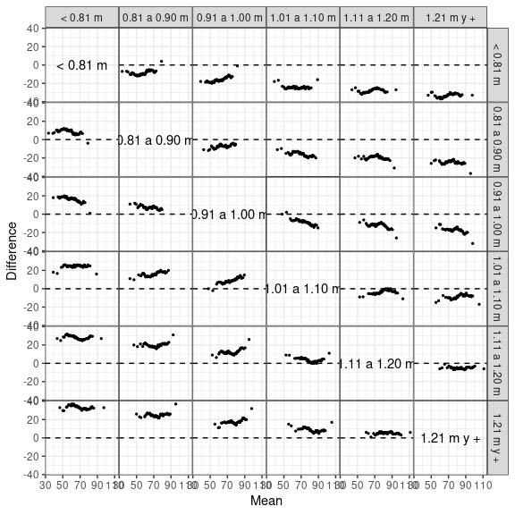

<!-- README.md is generated from README.Rmd. Please edit that file -->

# ggcleveland

## Gráficos para Análisis Exploratorio de Datos

## Plots for Exploratory Data Analysis

<!-- badges: start -->

[](https://lifecycle.r-lib.org/articles/stages.html)
<!-- badges: end -->

------------------------------------------------------------------------

Web: <https://mpru.github.io/ggcleveland/>

------------------------------------------------------------------------

El libro *Visualizing Data* de William S. Cleveland es una pieza clásica
en la literatura sobre Análisis Exploratorio de Datos (AED). Habiendo
sido escrito algunas décadas atrás, su contenido sigue siendo relevante
ya que propone herramientas útiles para descubrir patrones y relaciones
en los datos estudiados, como así también para evaluar ajustes. Este
paquete ofrece funciones que producen la versión en `ggplot2` de las
herramientas de visualización descriptas en este libro. Fue diseñado
como material complementario en cursos sobre AED.

------------------------------------------------------------------------

William S. Cleveland’s book ‘Visualizing Data’ is a classic piece of
literature on Exploratory Data Analysis (EDA). Although it was written
several decades ago, its content is still relevant as it proposes
several tools which are useful to discover patterns and relationships
among the data under study, and also to assess the goodness of fit o a
model. This package provides functions to produce the ggplot2 versions
of the visualization tools described in this book and is thought to be
used in the context of courses on EDA.

## Instalación / Instalation

<!-- 
You can install the released version of karel from [CRAN](https://CRAN.R-project.org) with:

``` r
install.packages("karel")
```
-->

Se puede instalar la versión en desarrollo del paquete `ggcleveland`
desde [GitHub](https://github.com/mpru/ggcleveland) con:

``` r
# install.packages("devtools")
devtools::install_github("mpru/ggcleveland")
```

## Ejemplos / Examples

Podés ver ejemplos de cada una de los gráficos producidos con este
paquete en las viñetas. Algunos de ellos son:

------------------------------------------------------------------------

You can explore examples of each of the plots produced by this package
in the vignettes. Some of them are:

*Gráficos condicionales / Coplots*:

``` r
library(ggcleveland)
library(dplyr)
library(ggplot2)
theme_set(theme_bw() + theme(panel.spacing = unit(0, "lines")))

data(rubber)

gg_coplot(rubber, x = tensile.strength, y = abrasion.loss, faceting = hardness,
  number_bins = 6, overlap = 3/4,
  ylabel = "Pérdida de abrasión (g/hp-hour))",
  xlabel = "Resistencia a la tracción (kg/cm2)",
  facet_label = "Dureza (grados Shore)", 
  loess_family = "symmetric", size = 2)
```


*Residual-Fit plots*:

``` r
data(futbol)

futbol <- 
  futbol %>% 
  group_by(longp) %>% 
  mutate(ajuste = mean(dist), res = dist - ajuste)

gg_rf(futbol, dist, ajuste, res, cen_obs = TRUE, ylabel = "Distancia (m)")
```


*Gráfico Media-Diferencia de Tukey / Tukey’s MD Plot*:

``` r
gg_tmd(futbol, dist, longp, size = 0.5)
```


