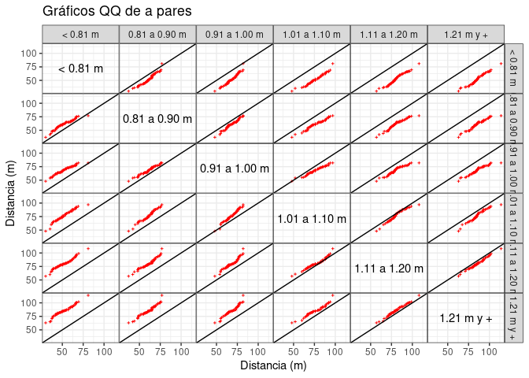
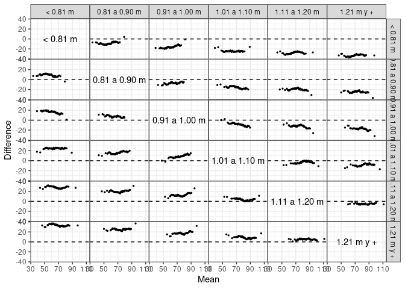
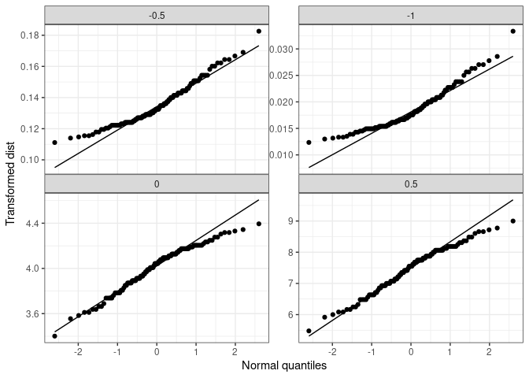

<!-- README.md is generated from README.Rmd. Please edit that file -->

|||||| **Work in progress** |||||| **En construcción** ||||||

# The ggcleveland R package

|||||| **Work in progress** |||||| **En construcción** ||||||

<!-- badges: start -->

[](https://CRAN.R-project.org/package=ggcleveland)
[](https://www.tidyverse.org/lifecycle/#experimental)
[](https://cran.rstudio.com/package=ggcleveland)
<!-- badges: end -->

Web: <https://mpru.github.io/ggcleveland/>

Este paquete implementa algunas funciones para crear las versiones en
`ggplot2` de algunos gráficos presentados por Cleveland en su libro
“Visualizing Data”. Ha sido creado para ser usado en cursos de
Análisis Exploratorio de Datos. Se encuentra en desarrollo y aún no ha
sido usado con diversos conjuntos de datos. Cualquier comentario o
sugerencia es bienvenida.

This packages provides functions to produce ggplot versions for some
visualizations tools described in Cleveland’s book “Visualizing Data”.
It is an experimental package, and was thought to be used in the context
of a course on exploratory data analysis. Any contributions or feedback
are appreciated.

## Instalación / Instalation

<!-- 
You can install the released version of karel from [CRAN](https://CRAN.R-project.org) with:

``` r
install.packages("karel")
```
-->

Se puede instalar la versión en desarrollo del paquete `ggcleveland`
desde [GitHub](https://github.com/mpru/ggcleveland) con:

``` r
# install.packages("devtools")
devtools::install_github("mpru/karel")
```

## Ejemplos / Examples

### gg\_quantiles

La función `gg_quantiles()` produce gráficos QQ (cuantil-cuantil) para
comparar la distribución de una variable cuantitativa en dos o más
grupos:

``` r
# Paquetes, datos y configuraciones
library(ggcleveland)
library(ggplot2)
library(dplyr)
#> 
#> Attaching package: 'dplyr'
#> The following objects are masked from 'package:stats':
#> 
#>     filter, lag
#> The following objects are masked from 'package:base':
#> 
#>     intersect, setdiff, setequal, union
theme_set(theme_bw() + theme(panel.spacing = unit(0, "lines")))
data("futbol")

# Dos grupos
futbol2 <- dplyr::filter(futbol, longp %in% c("< 0.81 m", "0.81 a 0.90 m"))
gg_quantiles(futbol2, dist, longp)
```


``` r

# Más de dos grupos
gg_quantiles(futbol, dist, longp, size = 0.4, color = "red", shape = 3) +
    labs(title = "Gráficos QQ de a pares", x = "Distancia (m)", y = "Distancia (m)")
```



También permite graficar los cuantiles de cada grupos vs cuantiles
calculados con todos los grupos combinados. Esto puede ser útil para
estudiar residuos luego de algún ajuste:

``` r
futbol <- 
  futbol %>% 
  group_by(longp) %>% 
  mutate(ajuste = mean(dist), res = dist - ajuste)

gg_quantiles(futbol, res, longp, combined = TRUE) 
```


### gg\_tmd

La función `gg_tmd()` produce el gráfico de medias-diferencias de Tukey
(Tukey’s Mean-Difference Plot):

``` r
# Dos grupos
gg_tmd(futbol2, dist, longp)
```


``` r

# Múltiples grupos
gg_tmd(futbol, dist, longp, size = 0.5)
```



### gg\_rf

La función `gg_rf()` produce un *residual-fit plot* (gráfico de residuos
y valores
ajustados):

``` r
gg_rf(futbol, dist, ajuste, res, ylabel = "Distancia (m)")
```


``` r

# Agregando las observaciones centradas por la media general
gg_rf(futbol, dist, ajuste, res, cen_obs = TRUE, ylabel = "Distancia (m)")
```


### gg\_sl

La función `gg_sl()` produce un *spread-location
plot*:

``` r
gg_sl(futbol2, dist, longp, xlabel = "Mediana de distancia jittered (m)")
```


### gg\_pt

La función `gg_pt()` produce un gráfico para evaluar transformaciones de
potencia, que consisten en elevar a las observaciones a un conjunto de
potencias señaladas en el argumento `taus`, en el cual el valor 0 indica
la transformación
logarítmica:

``` r
gg_pt(futbol2, dist, taus = c(-1, -0.5, 0, 0.5))
```



``` r

# Para cada grupo por separado
gg_pt(futbol2, dist, longp, taus = c(-1, -0.5, 0, 0.5))
```


